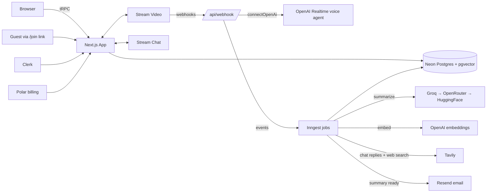

# CogniMeet.AI

[](https://github.com/devhimanshuu/CogniMeet.ai/actions/workflows/ci.yml)

AI-powered meeting intelligence platform. CogniMeet brings intelligent agents into your video meetings — they listen, take notes, extract action items, search the web, and generate insights automatically.

## Features

- **Live Video Calls** — Stream Video-powered meetings with auto-transcription, recording, and closed captions
- **Live AI Coworkers** — Your agent joins the call as a real voice participant (Stream + OpenAI Realtime, requires `OPENAI_API_KEY`) with custom personas (Scrum Master, Product Manager, Tech Architect, etc.)
- **Post-Meeting AI Analysis** — Auto-generated summaries, interactive action-item checklists, key decisions, topics, and productivity scores
- **Post-Meeting Chat (RAG)** — Continue talking with your AI agent; answers are grounded in the transcript chunks most relevant to your question (pgvector similarity search), with reliable background generation via Inngest
- **Cross-Meeting Semantic Search** — Ask "when did we decide X?" across everything ever said in your meetings (pgvector + OpenAI embeddings)
- **Agentic Web Search** — The chat agent decides on its own when to call Tavily web search (LLM tool calling)
- **Pre-Meeting Briefing** — Open action items and context from your last meeting with the same agent
- **LLM Fallback Chain** — Groq (primary) → OpenRouter (fallback) → HuggingFace (final fallback) for zero downtime
- **Premium Tier** — Polar-powered subscriptions with free tier limits (5 meetings, 3 agents)
- **Guest Invites** — Share a link and guests join the call without an account (`/join/<meetingId>`)
- **Notifications** — In-app bell with "summary ready" alerts as soon as background processing finishes, plus optional email via Resend
- **Durable Transcripts** — Transcripts are persisted to Postgres at processing time (Stream's hosted URLs expire)
- **Dashboard** — Stats, recent meetings, productivity score trend chart, and command palette (Cmd+K / Ctrl+K)

## Tech Stack

| Layer | Technology |
|-------|-----------|
| Framework | Next.js 15 (App Router) |
| Language | TypeScript 5 |
| Styling | Tailwind CSS 4 |
| Auth | Clerk |
| Database | PostgreSQL (Neon serverless) + pgvector |
| ORM | Drizzle |
| API | tRPC |
| Video | Stream Video SDK |
| Chat | Stream Chat SDK |
| Background Jobs | Inngest |
| AI (Primary) | Groq (Llama 3.3 70B) |
| AI (Fallback 1) | OpenRouter |
| AI (Fallback 2) | HuggingFace Inference |
| Web Search | Tavily |
| Payments | Polar |
| UI Components | shadcn/ui + Radix |

## Getting Started

### Prerequisites

- Node.js 20+
- PostgreSQL database ([Neon](https://neon.tech) recommended — includes pgvector)
- Accounts for: [Clerk](https://clerk.com), [Stream](https://getstream.io), [Groq](https://groq.com), [Polar](https://polar.sh), [OpenAI](https://platform.openai.com) (live agent + semantic search)

### 1. Clone and install

```bash
git clone https://github.com/devhimanshuu/CogniMeet.ai.git
cd CogniMeet.ai
npm install --legacy-peer-deps
```

### 2. Configure environment

```bash
cp .env.example .env
```

Fill in all values in `.env`. See [Environment Variables](#environment-variables) for details.

### 3. Set up the database

Semantic search uses pgvector, so enable the extension once (Neon SQL editor or psql):

```sql
CREATE EXTENSION IF NOT EXISTS vector;
```

Then push the schema:

```bash
npm run db:push
```

### 4. Set up webhooks (local development)

CogniMeet uses webhooks from Stream Video/Chat and Clerk. For local development, expose your local server with [ngrok](https://ngrok.com):

```bash
npm run dev:webhook
```

Configure webhook URLs in:
- **Stream Dashboard** (Video *and* Chat) → `https://your-ngrok-url/api/webhook`
- **Clerk Dashboard** → `https://your-ngrok-url/api/webhook/clerk`

### 5. Run the dev server and Inngest

Meeting analysis, transcript embedding, and AI chat replies run as [Inngest](https://www.inngest.com) background jobs, so run the Inngest dev server alongside Next.js:

```bash
npm run dev
# in a second terminal:
npx inngest-cli@latest dev
```

Open [http://localhost:3000](http://localhost:3000). The Inngest dashboard is at [http://localhost:8288](http://localhost:8288).

### 6. (Optional) Seed demo data

Sign in once so your user exists, then:

```bash
npm run seed
```

This creates 3 agents and 5 completed meetings — summaries, action-item checklists, transcripts, and scores — so the dashboard, insights, briefing, and chat views are instantly explorable.

## Environment Variables

| Variable | Description | Required |
|----------|-------------|----------|
| `DATABASE_URL` | Neon PostgreSQL connection string | Yes |
| `NEXT_PUBLIC_CLERK_PUBLISHABLE_KEY` | Clerk publishable key | Yes |
| `CLERK_SECRET_KEY` | Clerk secret key | Yes |
| `CLERK_WEBHOOK_SECRET` | Clerk webhook signing secret | Yes |
| `NEXT_PUBLIC_APP_URL` | App URL (change for production) | Yes |
| `NEXT_PUBLIC_STREAM_VIDEO_API_KEY` | Stream Video API key | Yes |
| `STREAM_VIDEO_SECRET_KEY` | Stream Video secret | Yes |
| `NEXT_PUBLIC_STREAM_CHAT_API_KEY` | Stream Chat API key | Yes |
| `STREAM_CHAT_SECRET_KEY` | Stream Chat secret | Yes |
| `OPENAI_API_KEY` | OpenAI API key — live voice agent (Stream + OpenAI Realtime) and embeddings for semantic search / RAG | For live agent & search |
| `RESEND_API_KEY` | Resend API key for "summary ready" emails | No |
| `EMAIL_FROM` | From address for emails (defaults to Resend onboarding sender) | No |
| `NEXT_PUBLIC_SENTRY_DSN` | Sentry DSN for error monitoring (dormant when unset) | No |
| `GROQ_API_KEY` | Groq API key (primary LLM) | Yes |
| `OPENROUTER_API_KEY` | OpenRouter API key (fallback LLM) | Yes |
| `HUGGINGFACE_API_KEY` | HuggingFace API key (final fallback) | Yes |
| `TAVILY_API_KEY` | Tavily web search API key | Yes |
| `ELEVENLABS_API_KEY` | ElevenLabs API key (reserved for voice) | No |
| `POLAR_ACCESS_TOKEN` | Polar subscription management token | Yes |

## Scripts

| Command | Description |
|---------|-------------|
| `npm run dev` | Start development server |
| `npm run dev:webhook` | Expose localhost via ngrok for webhook testing |
| `npm run build` | Production build |
| `npm run start` | Start production server |
| `npm run lint` | Run ESLint |
| `npm run db:push` | Push schema to database |
| `npm run db:studio` | Open Drizzle Studio GUI |
| `npm test` | Run unit tests (Vitest) |
| `npm run seed` | Seed demo agents/meetings for the first user (`-- --email you@x.com` for a specific user) |

## Project Structure

```
src/
├── app/                    # Next.js App Router pages
│   ├── (auth)/             # Sign-in / sign-up (Clerk catch-all routes)
│   ├── (dashboard)/        # Dashboard, agents, meetings, search, upgrade
│   ├── call/               # Live video call view (authenticated)
│   ├── join/               # Guest join flow (public, no account)
│   └── api/                # tRPC handler, webhooks, Inngest
├── modules/                # Feature modules
│   ├── agents/             # Agent CRUD, presets, UI
│   ├── meetings/           # Meeting CRUD, transcript, chat, insights UI
│   ├── search/             # Cross-meeting semantic search (pgvector)
│   ├── notifications/      # In-app notification bell + router
│   ├── premium/            # Subscription management
│   ├── dashboard/          # Dashboard stats, sidebar, navbar
│   ├── call/               # Video call provider, lobby, guest connect
│   └── landing/            # Landing page sections
├── components/             # Shared UI components (shadcn/ui)
├── db/                     # Drizzle schema and client
├── trpc/                   # tRPC init, client, routers
├── inngest/                # Background jobs (processing, chat, embeddings)
├── lib/                    # SDK clients (Stream, Polar, AI, Tavily, embeddings, email)
└── hooks/                  # Shared React hooks
scripts/seed.ts             # Demo data seeder
.github/workflows/ci.yml    # Type-check + lint + tests on every push
```

## How It Works

1. **Create an Agent** — Choose from presets or write custom instructions
2. **Schedule a Meeting** — Creates a Stream Video call (owner + agent as members) with auto-transcription and recording enabled; share the guest link with anyone
3. **Join the Call** — The AI agent connects as a live voice participant via Stream + OpenAI Realtime; the call header shows its status
4. **Webhooks Process Events** — Call start/end, participant changes, transcription ready, recording ready
5. **AI Analysis (Inngest)** — When the transcript is ready, Inngest parses it, runs the LLM fallback chain to extract summary/action items/decisions/topics/score, persists the transcript to Postgres, embeds it into pgvector chunks, then notifies you in-app (and by email via Resend, if configured)
6. **Ask Anything Afterwards** — Post-meeting chat retrieves the transcript chunks most relevant to each question (RAG) and can call Tavily web search on its own; the AI Search page answers questions across all your meetings

### Architecture



## Testing & CI

```bash
npm test          # Vitest unit tests (transcript parsing, LLM-output normalization)
npx tsc --noEmit  # strict type check
npm run lint      # ESLint
```

GitHub Actions runs type-check, lint, and tests on every push and pull request ([ci.yml](.github/workflows/ci.yml)).

## Design Notes

A few implementation decisions worth calling out:

- **Webhooks stay fast** — Stream webhooks only validate and enqueue; all slow work (LLM calls, embeddings, web search) happens in Inngest with retries, so webhook timeouts can never cause duplicate AI replies.
- **Billing can't block core features** — if Polar is unreachable or a customer record is missing, users degrade to the free tier instead of hitting errors.
- **Transcripts outlive Stream** — Stream's hosted transcript URLs expire, so the parsed transcript is persisted to Postgres at processing time and embedded into pgvector chunks for RAG.
- **The AI never replies to itself** — chat events from the agent's own user ID are dropped, and per-channel rate limiting (10 replies/min) caps LLM spend.
- **Everything degrades gracefully** — no `OPENAI_API_KEY` means no live agent or semantic search, but calls, transcription, and summaries keep working; Resend and Sentry are similarly opt-in.

## Deployment

The app is ready to deploy on [Vercel](https://vercel.com):

1. Push to GitHub
2. Import in Vercel
3. Set all environment variables (update `NEXT_PUBLIC_APP_URL` to your production domain)
4. Enable pgvector on the production database (`CREATE EXTENSION IF NOT EXISTS vector;`) and run `npm run db:push` against it
5. Connect the [Inngest Vercel integration](https://www.inngest.com/docs/deploy/vercel) so background jobs run in production
6. Update webhook URLs in the Stream (Video + Chat) and Clerk dashboards to point to your production domain

## License

MIT
